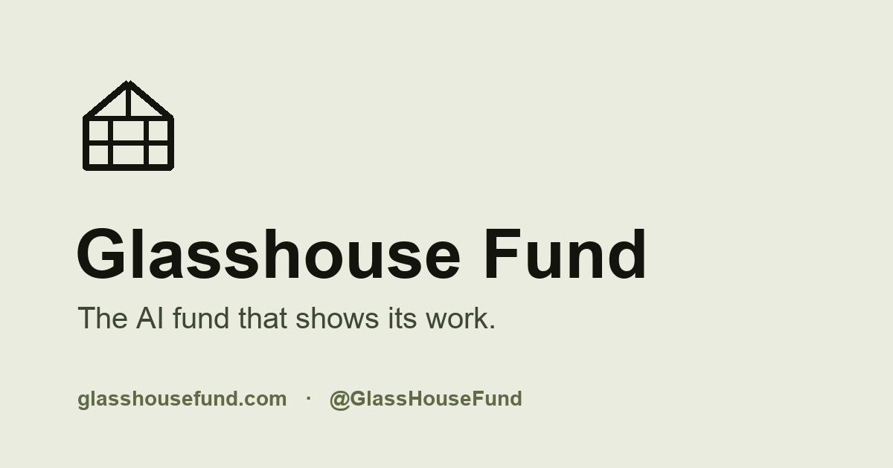

<p align="center">
  
</p>

<h1 align="center">Glasshouse&nbsp;Fund</h1>

<p align="center"><b>The AI fund that shows its work.</b></p>

<p align="center">
An autonomous AI manages a simulated <b>$1M</b> book — and publishes every decision, the
bull/bear/risk debate behind it, the evidence it cited, and how its predictions actually turn out.
</p>

<p align="center">
  <a href="https://glasshousefund.com"><b>Live site</b></a> ·
  <a href="https://glasshousefund.com/dashboard.html">Dashboard</a> ·
  <a href="https://glasshousefund.com/decisions.html">Decision journal</a> ·
  <a href="https://x.com/GlassHouseFund">@GlassHouseFund</a>
</p>

<p align="center"><sub>Paper trading — simulated capital, not investment advice.</sub></p>

---

An LLM-agent portfolio system with a hardened gateway, a deterministic risk engine, evals gating CI, crash-safe orchestration, chunked RAG over SEC filings, and a read-only MCP server you can point Claude at.

The interesting part is not the trading. It is what is built around an unreliable component — a language model — to make it produce an auditable record: a gateway that validates and retries, guardrails the model cannot argue past, a grounding check that blocks unsupported claims, and a scoreboard that grades its own predictions in public whether they were right or not.

**As of 2026-08-07, after 34 trading days:** 177 scored predictions, a **58.2%** hit rate and a **Brier score of 0.2464** — against 0.25 for a coin flip. Every confidence bucket above 0.6 is overconfident. That result is the point of the project, and it is published whether or not it flatters the model. See [prediction accuracy](https://glasshousefund.com/predictions.html) for the live curve.

## Features

### The decision loop

- **Analyst Debate**: Bull, bear, and risk analyst agents each argue a structured thesis, with the bear getting a rebuttal turn against the bull. The portfolio manager synthesizes them and must explicitly respond to the bear case. The full transcript is journaled and published.
- **Tool-Calling Research**: A research agent uses five typed tools (price, history, news, memory, portfolio) to investigate targeted follow-up questions before the decision. Invalid arguments return a structured error the model corrects rather than crashing the run; the ordered tool-call trace is journaled.
- **Deterministic risk engine**: Position sizing, daily turnover, sector concentration, a confidence floor, and stop-loss/take-profit exits are enforced in code, outside the model. Rebalance trades re-enter the same checks — there is no bypass.
- **Simulated trading**: A paper engine with full position tracking, marked against real prices. No broker, no real money, by design.

### Checking its own work

- **Prediction calibration**: Every run records a directional "beat/lag SPY" call for *every* researched name — holdings and watchlist alike, whether or not the fund trades it — at 5- and 30-day horizons, so the sample covers the model's full confidence distribution rather than only high-conviction names that became trades. Non-overlapping windows per (symbol, horizon) keep samples independent. Scored automatically into a Brier score and a calibration curve.
- **Grounding check**: Daily decisions and weekly letters are both checked against the facts they were given before anything publishes. Its limits are documented too — it verifies a number *came from* the fact base, not that the fact was *labelled* correctly.
- **Evals in CI**: A golden decision set, an ablation harness scoring the full system against no-memory and no-debate variants, plus chunking and grounding evals. Temperature 0, no network, run on every pull request.
- **Baselines**: Compared against buy-and-hold SPY, 100% QQQ, and the mean of 500 random equal-weight portfolios drawn from its own watchlist.
- **Run health watchdog**: An independent scheduled check that the fund actually ran and succeeded on each trading day. A run cancelled before its first step writes no row anywhere, so only an outside observer can notice the gap.

### What it publishes

- **Prerendered decision pages**: Every trading day gets a static, indexable page at `/decisions/YYYY-MM-DD.html` — trades, the full debate, cash thesis and market calls as real HTML rather than a client-side fetch. Plus per-ticker hub pages and a generated `sitemap.xml`.
- **Weekly investor letters**: An AI-written weekly letter (performance vs benchmark, winners and losers, portfolio changes, outlook) built from deterministically computed facts, gated by the grounding check, published at a dated permalink under `/letters/`.
- **Public dashboard**: Portfolio, run status, prediction accuracy and decision journal, with last-updated metadata.
- **Tweets**: Daily posts drafted by a tweet-writer agent through the same gateway as every other agent.
- **MCP server**: A read-only [MCP](https://modelcontextprotocol.io) server (`mcp_server/`) exposes the fund to Claude Desktop/Code — holdings, performance history, trades, decision journal, debate transcripts and memory search — so you can ask "why did the fund sell NVDA in June?" against real data.

### Memory

- **Weekly reflection**: A weekly graph reads the week's resolved predictions and trades and synthesizes `risk_lesson` / `mistake` memories, each grounded in the prediction and trade ids it came from, so lessons resurface in the next daily run.
- **Chunked RAG over SEC filings**: Metadata-filtered vector search in Qdrant, retrieved per run in four typed groups (symbol theses, risk lessons, recent trades, macro context).

## Setup

1. Clone the repository
2. Install the package and its dependencies (this is what CI does, and it puts
   `src/` on the path so the scripts resolve):
   ```bash
   pip install -e .
   ```
3. Copy `.env.example` to `.env` and fill in your API keys:
   ```bash
   cp .env.example .env
   ```
4. Run the daily portfolio update:
   ```bash
   python scripts/daily_run.py
   ```

The run exits non-zero if the cycle records an error, so it can be scheduled without
a failure silently reporting success.

## Local Commands

Common local workflows are available through `make`:

```bash
make test
make eval
make baselines
make eval-ablate
make run
make dashboard PORT=8001
make ingest-memory
make status
```

The daily cycle runs as a LangGraph workflow (`src/workflows/daily_graph.py`); `make run` and the scheduled GitHub Action both invoke it via `scripts/daily_run.py`.

### Decision Evals

`make eval` runs the portfolio manager against golden scenarios in `evals/` (bull
market, crash, high cash, overconcentration, missing data, stale memory) and scores
each decision with deterministic scorers (schema validity, risk compliance, citation
validity) plus an optional LLM-as-judge grounding check. Results are persisted to
`data/eval_results.jsonl` with the model and prompt version. A GitHub Action
(`.github/workflows/evals.yml`) runs the evals at temperature 0 on pull requests that
touch prompts, schemas, or the agent — so a change that breaks the prompt fails CI.
Running live needs `OPENAI_API_KEY`; the scorers and runner are fully unit-tested
without one.

### Does the machinery actually help? (baselines + ablations)

The obvious question about any AI fund is "does the AI part do anything?" Two
harnesses answer it, both surfaced on the dashboard:

- **`make baselines`** — scores the live fund against buy-and-hold **SPY**,
  buy-and-hold **QQQ**, and a **random-from-watchlist** portfolio (the mean of 500
  random equal-weight draws — the "beat a monkey?" test). Pure price math, no LLM;
  runs on every daily cycle and writes `public/baseline_comparison.json`
  (`src/experiments/baselines.py`, `comparison.py`).
- **`make eval-ablate`** — the deeper question: does the *machinery* improve the
  decision? It runs the same scenarios through the same decision code three ways —
  **full** (memory + debate), **no-memory**, and **no-debate** — holding the model,
  prompt, and temperature constant, then grades every decision with a single fixed
  judge so the score reflects the ablated component, not the grader. Reports a
  quality-vs-full delta table and writes `public/ablation_comparison.json`
  (`scripts/compare_ablations.py`, `src/experiments/ablations.py`,
  `evals/ablation_scenarios.py`). A negative delta means removing that piece lowered
  decision quality — i.e. it earns its keep.

  Honest scope: this measures *reasoning quality on an eval set*, not live P&L, and
  the *tools* ablation isn't measurable this way (the eval scenarios carry research
  as a fixed input) — that needs the live pipeline / a replay harness. Needs
  `OPENAI_API_KEY`; the wiring and aggregation are unit-tested without one.

## Project Structure

```
src/
  workflows/       - The LangGraph daily cycle and the weekly reflection graph
  agents/          - Portfolio manager, analysts, risk manager, rebalancer,
                     research agent, investor letter, tweet writer
  llm/             - The gateway: tiered routing, structured-output validation,
                     repair retry, backoff, tool-calling loop, cost logging
  research/        - Deterministic market-context assembly (prices, returns, news)
  memory/          - Qdrant vector store, extractors, grouped retrieval
  scoring/         - Grounding check and prediction scorer
  simulator/       - Portfolio engine and performance tracking
  storage/         - Append-only stores: decisions/predictions/letters (JSONL),
                     trades and history (CSV), portfolio state (JSON),
                     run progress (SQLite)
  reporting/       - Markdown reports, public JSON exports, prerendered decision,
                     symbol and letter pages, sitemap
  data_sources/    - Market data, news and benchmark fetchers
  experiments/     - Ablations and baseline comparisons
  observability/   - Tracing and run status
  social/          - X publishing
  models/          - Dataclasses (portfolio, trade, prediction, run state)
  utils/           - Logging, market hours, date helpers
mcp_server/        - Read-only MCP server exposing the fund
evals/             - Golden decision set and ablation scenarios
prompts/           - Versioned prompt templates
config/            - Watchlist and sector maps
scripts/           - CLI entry points (daily run, health check, backfill, evals)
tests/             - Unit tests
docs/              - Roadmaps, incident log, article notes
public/            - The published site: dashboard, decisions, letters, symbols,
                     predictions and static exports
```

## Configuration

All configuration is managed via environment variables. See `.env.example` for required keys.

## Automation

GitHub Actions runs the portfolio cycle twice each weekday (`.github/workflows/daily-run.yml`, at 14:40 and 17:50 UTC). Those times budget for GitHub's scheduler, which on this repo has started runs 59–101 minutes late as a rule and once by ~4h45m; a market-hours guard aborts a run that lands outside regular US market hours (9:30am–4:00pm America/New_York), so the cron times are chosen to stay in-hours even when late. Manual workflow dispatches always run.

Each cron slot has its own concurrency group. They previously shared one, and on 2026-08-06 a late morning run was still queued when the afternoon run arrived and evicted it — the fund lost a whole trading day.

**Run health check** (`.github/workflows/run-health.yml`) — a separate watchdog at 22:15 UTC on weekdays that verifies the fund actually ran and succeeded that trading day, and fails (emailing the owner) if not. It is deliberately independent of the daily run: a run cancelled before its first step writes no `run_history` row, so the pipeline cannot detect its own absence. It stays quiet on weekends, on the market holidays listed in `scripts/check_run_health.py`, and when a failed run was recovered by the day's second slot. Run it by hand for any date:

```bash
python scripts/check_run_health.py --date 2026-08-06
```

### Qdrant Memory Store

The memory layer uses Qdrant for vector search over prior reports. By default, local development uses:

```bash
QDRANT_URL=http://localhost:6333
```

To run Qdrant locally:

```bash
docker run -p 6333:6333 qdrant/qdrant
```

Then ingest existing reports:

```bash
python -m src.memory.ingest
```

For Qdrant Cloud, set both values in `.env`:

```bash
QDRANT_URL=https://your-cluster-url
QDRANT_API_KEY=your-qdrant-cloud-api-key
```

If Qdrant or embeddings are unavailable, the daily cycle logs the failure, records
`memory_status="unavailable"` and `memory_error` in the decision journal, and
continues without memory context.

#### SEC filing ingestion (chunked)

The weekly SEC ingestion (`scripts/ingest_sec_filings.py`) pulls three source types
from EDGAR into the same memory schema:

- **10-K** — Items 1, 1A, 7, 7A (`10k:…` ids).
- **10-Q** — Part I MD&A and market-risk items (`10q:…` ids).
- **8-K earnings** — the EX-99 earnings-release exhibit of the latest Item 2.02 8-K
  (`earnings_event:…` ids).

`--forms 10-K,10-Q,8-K` selects which to ingest. Each source splits into overlapping
~1k-char chunks (`src/memory/chunking.py`) rather than storing one oversized vector —
so retrieval surfaces the specific passage that answers a query. Each chunk is its
own record with a deterministic id and rich payload metadata (ticker, form, item,
filing date, and **sector** from `config/sectors.yaml`). All source ids are citable,
so the decision journal can attribute a view to a specific filing or earnings release.
Retrieval pushes symbol/type/sector constraints into Qdrant as payload filters
(`build_qdrant_filter`) instead of over-fetching and filtering in Python.

`make chunking-eval` quantifies the payoff offline (in-memory Qdrant + a
deterministic hashing embedder, no API key): over 20 scenarios where the answer is a
passage buried in a section of boilerplate, chunking lifts hit@1 from 0.15 → 1.00 and
MRR from 0.26 → 1.00 versus storing whole sections. The before/after is committed at
`tests/fixtures/memory_evals/chunking_baseline.json`.

### Run Observability

Each daily cycle generates a `run_id` and records it in the decision journal,
executed trades, prediction records created from trades, generated reports, and
public exports. The latest run status is exported to:

```bash
public/run_status.json
```

The public dashboard displays the latest run status, completion time, memory
retrieval status, number of trades executed, warning count, and per-run LLM
cost. Every run's final status is also appended to a durable history
(`data/run_history.jsonl`, exported to `public/run_history.json`) so run history
survives across runs rather than only showing the latest.

Per-run LLM cost/latency is aggregated from the gateway's call log (each call is
tagged with its `run_id`) and included in `run_status.json` under `llm`.

The graph also **routes conditionally**: an empty decision or an all-rejected risk
review skips the execution nodes and goes straight to journaling, and each branch
(empty decision, no approved trades, memory unavailable, execution failure) is
recorded under `run_status.diagnostics`.

### Crash Recovery (Resume)

The daily graph's live state (engine, market/news clients, stores) isn't
serializable, so instead of LangGraph's native checkpointer the run's *progress* is
persisted to a SQLite store (`src/storage/run_progress_store.py`) — which phases have
completed, per `run_id`. If a process dies mid-run, `python scripts/daily_run.py
--resume` re-enters the most recent unfinished run **reusing its `run_id`**. The P0-3
idempotent stores (trades/decisions/predictions keyed by `run_id`) make re-execution
duplicate-free, and the one non-idempotent external side effect — publishing a tweet
— is skipped on resume if it already went out.

### LLM Tracing (optional)

Set `LANGFUSE_PUBLIC_KEY` and `LANGFUSE_SECRET_KEY` to trace each run to
[Langfuse](https://langfuse.com): one trace per run, with a span per graph node
and a generation (model, tokens, cost) per LLM call. Without the keys, tracing is
a silent no-op and never affects a run.

### Analyst Debate

The decision step runs a mini investment committee with **information asymmetry** —
each analyst argues from a *different slice* of the context so their views can
genuinely diverge instead of clustering: `BullAnalyst` sees momentum + news,
`BearAnalyst` sees downside signals + cautionary memory, `RiskAnalyst` sees computed
exposures (position + sector concentration, cash). The bear then gets a **rebuttal
turn** against the bull (a real second turn, not three parallel monologues), and a
**conviction-spread** metric (max−min across analysts) records how much they actually
disagreed. The portfolio manager (strong tier) synthesizes it all and must fill a
`bear_case_response` addressing each major bear point. The transcript, rebuttal, and
spread are journaled and rendered on the decisions dashboard. Set `ENABLE_DEBATE=false`
to ablate the committee (the PM decides directly). See `src/agents/analysts.py` and
`src/agents/debate.py`.

### Tool-Calling Research

After the deterministic `MarketContextBuilder` assembles the base context, a
tool-calling research agent (`src/agents/research_agent.py`) does targeted
follow-up. It has five typed tools (`get_price`, `get_history`, `search_news`,
`retrieve_memory`, `get_portfolio`) exposed through a registry (`src/llm/tools.py`)
that validates the model's arguments — invalid args return a structured error the
model corrects rather than crashing the run. The gateway's `complete_with_tools`
loop executes the tools and feeds results back until the agent writes a brief
(capped at `max_rounds`). The brief is merged into the decision context; the brief
and its ordered tool-call trace are stored on the decision journal and rendered on
the decisions dashboard. Runs on the cheap tier.

### Model Routing & Fallback

Every LLM call is routed by **tier** through a provider abstraction
(`src/llm/providers/`, `src/llm/routing.py`): the **strong** tier serves final
decisions and PM synthesis; the **cheap** tier serves analysts, summaries, and
tweets; and a separate **judge** tier serves the graders — the grounding gate and
the decision-quality rubric. Each tier resolves to a `(provider, model)` route. The strong tier
defaults to `gpt-5.6-terra` and the cheap tier to `gpt-5.6-luna` — a *measured* choice:
`make eval-compare` runs the decision evals under each candidate model and reports a
quality-vs-cost table. It found the flagships (`gpt-4o`, `gpt-4.1`) cost ~11× more for
no reliable quality gain, and later that both `gpt-5.6` variants beat the incumbent
`gpt-4.1-mini` (4.21 and 4.17 vs 3.71 out of 5), with `luna` costing *less* per token
(see [docs/model-selection.md](docs/model-selection.md)).
The judge tier is pinned to `gpt-4.1-mini` (`LLM_JUDGE_MODEL`) and is deliberately
slow to change: a grader that follows the model under test measures nothing, since
upgrading the model silently upgrades its own examiner. Override any tier via
`LLM_STRONG_MODEL` / `LLM_CHEAP_MODEL` / `LLM_JUDGE_MODEL`, and run
`make probe-models` before a swap to surface the new model's API quirks. If
`LLM_FALLBACK_PROVIDER` / `LLM_FALLBACK_MODEL` are set, a call that exhausts retries
on its primary route falls back to that route before failing; the cost log records
the serving `provider` and whether it `fell_back`. Only OpenAI ships today — the
interface is provider-agnostic so others slot in.

### Grounding Check

Before a decision is journaled and tweeted, an LLM-as-judge grounding check
(`src/scoring/grounding.py`) verifies its factual claims (prices, returns, news,
memory references) against the context the manager actually had. Findings are
stored on the decision journal entry under `grounding`, and a flagged decision
**blocks tweeting** (`tweet_publish.status = "blocked_grounding"`) so the fund never
posts unsupported claims. If the judge is unavailable the check degrades to
`unavailable` (non-blocking) rather than failing the run. The judge shares its
schema with the offline eval harness (`evals/grounding.py`).

### Human-in-the-Loop Approval

By default (`AUTO_APPROVE=true`) the daily cycle runs unattended. Set
`AUTO_APPROVE=false` to insert a human approval gate after risk review and before
execution: the run prints the pending trades and prompts you in the terminal to
approve all, reject all, or edit down to a chosen subset. The decision is recorded
in `run_status.human_review`. (This gate is in-process; the run must stay open for
approval. Durable cross-process approval is a planned follow-up.)

### Weekly Reflection

A separate weekly graph (`src/workflows/weekly_reflection_graph.py`, run via
`make reflect` or the `Weekly Reflection` GitHub Action) gathers the past week's
*resolved* predictions and executed trades, asks the model to distill concrete
`risk_lesson` / `mistake` memories — each carrying the source prediction/trade ids
it was grounded in — and ingests them. Memory ids are deterministic per
`(week, index)`, so re-running a week upserts the same points instead of
duplicating. Because the lessons are `risk_lesson` / `mistake` memories, they
surface in the next daily run's `risk_lessons` retrieval group.

### Risk Engine V2

Beyond per-position sizing and daily turnover, the deterministic risk layer adds:

- **Sector-concentration limits** — the `RiskManagerAgent` caps BUYs so no single
  GICS sector (`config/sectors.yaml`) exceeds `MAX_SECTOR_CONCENTRATION` (default
  40%) of the portfolio; a breaching BUY is trimmed or rejected. Applies wherever
  risk review runs, including rebalance deployment.
- **Stop-loss / take-profit exits** — before risk review, `generate_risk_events`
  scans marked-to-market positions and emits **system** SELLs for any position down
  more than `STOP_LOSS_PCT` (15%) or up more than `TAKE_PROFIT_PCT` (40%) from cost
  basis. These take precedence over any LLM trade for the same symbol, flow through
  the same guardrails and execution path, and are journaled as first-class risk
  events (`risk_events`, `origin="system"`).

### Weekly Investor Letter

`make letter` (or the `Weekly Investor Letter` GitHub Action) computes the week's
facts deterministically — portfolio return vs SPY, winners/losers, and the week's
trades — then has the model (via the gateway) write a letter grounded in *exactly*
those facts. The shared grounding check (`check_grounding`) runs **before publish**:
a flagged letter is blocked and nothing is written. A grounded letter is recorded
(idempotent per week via `InvestorLetterStore`) and exported to
`public/investor_letter.{json,md}`. Set `POST_INVESTOR_LETTER=true` to also post it
as an X thread (off by default).

### MCP Server

A read-only MCP server (`mcp_server/`, `make mcp`) exposes the fund to any MCP
client (Claude Desktop / Claude Code) with tools for holdings, performance history,
trades, decision journal, debate transcripts, and memory search — so you can ask
*"why did the fund sell NVDA in June?"* against the real committed data. No tool can
place a trade or mutate state. Setup and the client config snippet are in
[`mcp_server/README.md`](mcp_server/README.md).

Do not commit `.env` or real API keys.

## Roadmap

**Current plan (V2):** [docs/ROADMAP-V2.md](docs/ROADMAP-V2.md) — after the v1 roadmap
was fully executed, a clean-slate audit reframed the work around *proving the AI
machinery helps* (baselines + ablations), distribution (presentation, launch,
content), and turning the fund into a multi-fund experimentation platform. Task specs
are in [.claude/TODO.md](.claude/TODO.md).

**v1 (all delivered):** [docs/ROADMAP.md](docs/ROADMAP.md) — six phases that built the
machinery:

0. **Harden the foundation** — an LLM gateway with Pydantic-validated structured outputs, retries, configurable models, and idempotent stores.
1. **Orchestration & observability** — promote the LangGraph runner to the default path, add checkpointing, conditional routing, a human-in-the-loop approval gate before execution, and Langfuse tracing with cost tracking.
2. **Evals & calibration** — golden-scenario decision evals in CI, grounding checks before journaling, and Brier-score/calibration dashboards for prediction accuracy.
3. **Multi-agent & tools** — bull/bear/risk analyst debate with recorded transcripts, typed tool calling for research, and cheap-vs-strong model routing.
4. **Knowledge layer** — chunked, metadata-filtered RAG over SEC filings and earnings transcripts, plus a weekly lessons-learned reflection agent.
5. **Surface & reach** — an MCP server exposing the fund, Risk Engine V2 (sector limits, stop-loss/take-profit), and a weekly investor letter.

## License

MIT
